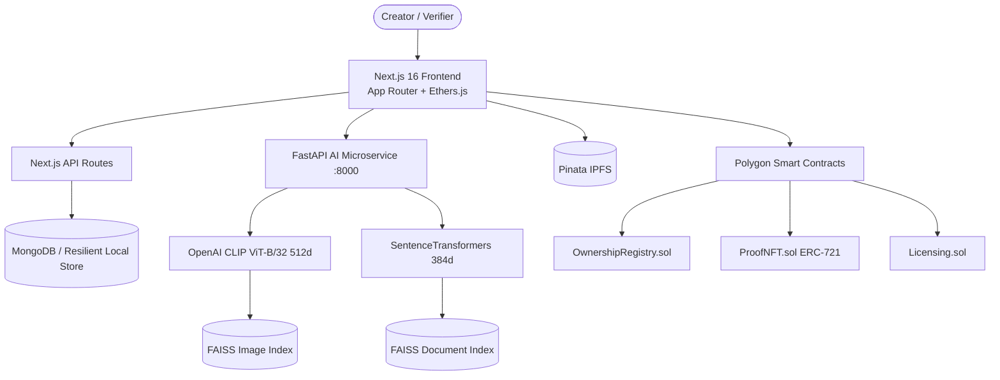

# ProofVault AI

AI + Blockchain powered digital ownership verification

> **ProofVault AI creates tamper-resistant registration evidence for digital assets and detects both exact duplicates and modified variations using multi-layer cryptographic hashing, neural AI perceptual similarity search, IPFS, and Polygon blockchain smart contracts.**

[](https://nextjs.org/)
[](https://fastapi.tiangolo.com/)
[](https://soliditylang.org/)
[](https://polygon.technology/)
[](https://pytorch.org/)
[](https://github.com/facebookresearch/faiss)

---

## 🎯 What is ProofVault AI?

Digital content—including artwork, source code, research papers, and audio recordings—can be copied, compressed, cropped, modified, and redistributed across the internet within seconds. Traditional cryptographic checksums (like SHA-256 alone) detect exact byte matches, but break down completely when an image is resized, filtered, or slightly edited.

ProofVault AI bridges this gap by combining **cryptographic hashing**, **deep neural AI vision embeddings**, **decentralized storage**, and **smart contracts** to establish verifiable, tamper-evident registration evidence for original creations.

When a creator uploads an asset, ProofVault AI generates multi-algorithm cryptographic hashes alongside deep perceptual embeddings, pins off-chain metadata to IPFS, anchors registration on the Polygon blockchain with commit-reveal front-running defense, and mints an ERC-721 Proof NFT. Later, any verifier can upload an original or modified file to test for exact matches or near-duplicate AI similarities.

> **Legal Note:** ProofVault AI provides tamper-evident cryptographic registration and ownership evidence. Blockchain registration records mathematical provenance and does not by itself constitute statutory government copyright grant.

---

## 💡 Core Idea

```text
Digital Asset
     ↓
Cryptographic Hash (SHA-256 / SHA-3 / BLAKE3)
     ↓
AI Fingerprint (CLIP 512d / SentenceTransformers 384d / pHash)
     ↓
IPFS Decentralized Storage (Pinata)
     ↓
Polygon Blockchain (Commit-Reveal Registration)
     ↓
Proof NFT (1:1 ERC-721 Token)
     ↓
Multi-Modal Verification (Exact & FAISS Vector Search)
```

| Layer | Purpose in ProofVault AI |
| :--- | :--- |
| **SHA-256 / SHA-3 / BLAKE3** | Exact file tamper detection using Web Crypto & `@noble/hashes` |
| **2D-DCT Perceptual Hash (pHash)** | Canvas luminance discrete cosine transform for visual fingerprinting |
| **OpenAI CLIP ViT-B/32** | 512-dimensional multimodal vision embeddings to detect visual derivatives |
| **SentenceTransformers** | 384-dimensional semantic text/code embeddings for document originality |
| **Meta FAISS** | High-performance vector index (`IndexFlatIP`) for real-time cosine similarity search |
| **Pinata IPFS** | Permanent decentralized file and metadata storage |
| **Polygon Blockchain** | Immutable, timestamped ownership records with commit-reveal defense |
| **Smart Contracts** | Asset registry (`OwnershipRegistry.sol`), 1:1 Proof NFTs (`ProofNFT.sol`), and licensing (`Licensing.sol`) |
| **MongoDB & Resilient Storage** | User sessions, activity logs, and asset catalog with automatic offline fallback |

---

## 🚀 Why ProofVault AI is Different

1. **Exact + Perceptual Verification**: Catches identical files (100% hash match) and modified derivatives (near-match vector similarity).
2. **Real Neural AI Inference**: Uses real PyTorch CLIP ViT-B/32 and SentenceTransformers models with Meta FAISS indexing.
3. **Front-Running Protected Anchoring**: Polygon smart contracts use a two-phase commit-reveal timelock to defeat mempool front-running.
4. **Decentralized Provenance**: Content metadata and thumbnails are permanently pinned to IPFS.
5. **End-to-End Creator Flow**: Seamless authentication, multi-hashing, on-chain registration, NFT minting, licensing, and public verification in one dashboard.

---

## ✨ Key Features

* **Dual Authentication**: Web2 Email/Password (bcrypt 12 rounds + JWT) & Web3 MetaMask SIWE (EIP-4361).
* **Multi-Hash Engine**: Client-side SHA-256, FIPS 202 SHA3-256, BLAKE3, and 2D-DCT pHash.
* **AI Similarity Search**: Real-time detection of cropped, rotated, compressed, or brightness-adjusted copies via CLIP + FAISS.
* **Polygon Smart Contracts**:
  * `OwnershipRegistry.sol`: Immutable registry with commit-reveal timelocks.
  * `ProofNFT.sol`: Strict 1-to-1 ERC-721 token bound to registered hashes.
  * `Licensing.sol`: Personal, Commercial, and Exclusive licenses with pull-withdrawal payouts.
* **Creator Dashboard**: 10 interactive routes with asset library (Grid/List views), search filters, and analytics telemetry.
* **Public Verification Portal**: Instant drag-and-drop verification with confidence scores.
* **Proof Certificates**: Downloadable ownership certificate with cryptographic audit trail.

---

## 🏗️ Architecture



---

## 📊 Validated Project Metrics

| Category | Verified Project Metric | Result |
| :--- | :--- | :--- |
| **Exact Match Accuracy** | Identical file re-upload | **100.0%** (`exact_match`) |
| **Cropped Variant AI Match** | Center cropped image | **98.63%** (`near_match`) |
| **Compressed Variant AI Match** | 50×50 resized image | **96.76%** (`near_match`) |
| **Rotated Variant AI Match** | 45° rotated image | **86.39%** (`near_match`) |
| **Smart Contracts** | Audited Solidity contracts | **3** (`OwnershipRegistry`, `ProofNFT`, `Licensing`) |
| **AI Neural Models** | In-memory inference models | **2** (`CLIP ViT-B/32` + `SentenceTransformers`) |
| **Vector Indexes** | FAISS `IndexFlatIP` indices | **2** (512d Image + 384d Document) |
| **Dashboard Routes** | Next.js App Router pages | **10** active routes |
| **Frontend Startup** | Turbopack dev server | **~433ms** |

---

## 🧰 Technology Stack

| Layer | Technologies |
| :--- | :--- |
| **Frontend** | Next.js 16.3.0 (App Router), React 19, TailwindCSS v4, Framer Motion, Lucide React |
| **Backend / AI** | FastAPI, PyTorch, HuggingFace CLIP ViT-B/32, Sentence-Transformers, Meta FAISS, OpenCV |
| **Blockchain** | Solidity 0.8.24, Hardhat, Ethers.js v6, Polygon Amoy Testnet, OpenZeppelin Contracts |
| **Storage** | Pinata IPFS SDK (`pinata-web3`) |
| **Database** | MongoDB 7.0 & Mongoose (with automatic resilient local storage fallback) |
| **Authentication** | bcrypt (12 rounds), JWT (HS256), SIWE / EIP-4361, HTTP-only secure cookies |
| **Security** | OpenZeppelin `ReentrancyGuard`, `Ownable`, commit-reveal timelocks, rate limiting |
| **DevOps** | Docker, Docker Compose, Turbopack |

---

## ⚙️ Requirements

* **Node.js**: `v20.x` or `v22.x` (LTS) & `npm`
* **Python**: `3.10` to `3.14` (with `pip`)
* **Git**
* **MetaMask Extension** *(optional, for Web3 features)*
* **Docker Desktop** *(optional, for containerized run)*
* **MongoDB** *(optional, automatic local file fallback included)*

---

## 🔑 Environment Setup

Create `.env` in the project root based on `.env.example`:

```env
# Database (MongoDB connection or automatic local fallback)
MONGODB_URI=mongodb://localhost:27017/proofvault

# IPFS Decentralized Storage (Pinata credentials)
PINATA_API_KEY=your_pinata_api_key
PINATA_SECRET_API_KEY=your_pinata_secret_key
PINATA_JWT=your_pinata_jwt_token
NEXT_PUBLIC_GATEWAY_URL=gateway.pinata.cloud

# Blockchain (Polygon Amoy Testnet)
AMOY_RPC_URL=https://rpc-amoy.polygon.technology
PRIVATE_KEY=your_testnet_deployer_private_key

# Smart Contract Addresses (Populated from deployment)
NEXT_PUBLIC_REGISTRY_ADDRESS=0x5FbDB2315678afecb367f032d93F642f64180aa3
NEXT_PUBLIC_PROOF_NFT_ADDRESS=0xe7f1725E7734CE288F8367e1Bb143E90bb3F0512
NEXT_PUBLIC_LICENSING_ADDRESS=0x9fE46736679d2D9a65F0992F2272dE9f3c7fa6e0

# Backend AI Microservice
NEXT_PUBLIC_FASTAPI_URL=http://localhost:8000

# Authentication Secret
JWT_SECRET=your_32_character_jwt_secret_signing_key
```

> [!WARNING]
> *Never commit real private keys, API tokens, seed phrases, or production secrets to source control.*

---

## ▶️ Run the Project

### Option A — Docker Compose (Recommended)
```bash
# Build and start all services
docker compose up --build

# Verify container health
docker compose ps

# View unified logs
docker compose logs -f

# Stop containers
docker compose down
```
Open **`http://localhost:3000`** in your browser.

### Option B — Manual Local Startup

```bash
# 1. Install frontend dependencies
npm install

# 2. Setup and activate backend virtual environment
cd backend
python -m venv .venv
# Windows: .venv\Scripts\activate | Linux/macOS: source .venv/bin/activate
pip install -r requirements.txt

# 3. Start FastAPI AI Engine (from backend/)
python -m uvicorn main:app --host 0.0.0.0 --port 8000

# 4. Start Next.js Frontend (from root directory in a second terminal)
npm run dev
```

* **Frontend:** `http://localhost:3000`
* **AI Health Endpoint:** `http://localhost:8000/health`

---

## ⛓️ Polygon Amoy Setup

ProofVault AI smart contracts are configured for the Polygon Amoy Testnet (Chain ID: `80002`):

```bash
# 1. Compile smart contracts
cd blockchain
npx hardhat compile

# 2. Deploy contracts to Polygon Amoy (requires funded testnet private key)
npx hardhat run scripts/deploy.ts --network polygonAmoy
```

Contracts included:
1. **`OwnershipRegistry.sol`**: Manages hash commitments, reveal verifications, and immutable ownership records.
2. **`ProofNFT.sol`**: ERC-721 token enforcing strict 1-to-1 uniqueness per asset hash.
3. **`Licensing.sol`**: Multi-tier licensing terms with automatic overpayment refunds and pull withdrawals.

---

## 👤 Judge Quick Start

### Local/Test Demo Account
A pre-configured test account is ready for instant evaluation without manual setup:

| Field | Test Value | Notes |
| :--- | :--- | :--- |
| **Email** | `proofvault.demo@test.local` | Pre-registered local test user |
| **Username** | `proofvaultdemo` | Login identifier |
| **Password** | `PV#Demo2026!Secure` | Hashed with bcrypt (12 rounds) |
| **Role** | Creator | Full dashboard access |
| **Web3 Login** | Connect MetaMask | Sign SIWE challenge (EIP-4361) |

---

## 🎬 3-Minute Hackathon Demo

* **0:00–0:30 — Problem & Login**: Navigate to `/auth/login` and log in with the test account above.  
  *Judge should notice: Instant JWT session creation with secure HTTP-only cookies.*
* **0:30–1:00 — Upload Asset**: Navigate to `/dashboard/upload` and drag & drop an image or file.  
  *Judge should notice: Real-time metadata extraction, title parsing, and file size formatting.*
* **1:00–1:45 — Register Asset**: Click *"Execute Cryptographic Registration"*.  
  *Judge should notice: Real-time pipeline running client-side SHA-256/SHA-3/BLAKE3 multi-hashing → 512d CLIP AI vector embedding → IPFS pinning → Polygon smart contract commit.*
* **1:45–2:30 — Verification (Exact Match & AI Near-Match)**:
  * Upload the original image to `/dashboard/verify` → **100% Exact Match Confirmed ✅**.
  * Upload a cropped, compressed, or rotated version → **Near-Duplicate Match (86%–99%) ⚠️** detected by FAISS vector search.  
  *Judge should notice: Cryptographic hashing identifies exact files while AI/FAISS catches altered derivatives.*
* **2:30–3:00 — Proof Certificate & On-Chain State**: Inspect the generated certificate, transaction hash, and asset library record.  
  *Judge should notice: Immutable, tamper-resistant evidence linking creator identity, cryptographic hashes, IPFS CIDs, and Polygon transactions.*

> **"ProofVault AI turns digital ownership claims into verifiable, tamper-resistant registration evidence."**

---

## 🌍 Real-World Industries

| Industry | Real-World Use Case |
| :--- | :--- |
| **Digital Art & Design** | Timestamp original artwork before publishing and detect uncredited derivatives. |
| **Software Development** | Anchor proprietary source code, algorithms, and smart contracts for provenance. |
| **Research & Academia** | Establish timestamped priority claims on preprints, papers, and dataset releases. |
| **Music & Media** | Register master audio tracks and sample packs with immutable on-chain timestamps. |
| **Advertising & Branding** | Prevent trademark logo tampering and enforce brand asset licensing terms. |
| **Enterprise IP** | Manage decentralized multi-tier licensing and programmatic pull-withdrawal payouts. |
| **AI & Generative Content** | Track training data provenance and prove human authorship origins. |

---

## 🔐 Security

* **Cryptographic Hashing**: Web Crypto SHA-256, FIPS 202 SHA3-256, and BLAKE3.
* **Authentication**: Password hashing with bcrypt (12 rounds) & HS256 JWT access/refresh token rotation.
* **Web3 Identity**: Sign-In with Ethereum (EIP-4361) with 10-minute nonce TTL and timestamp replay guards.
* **Smart Contract Defenses**: OpenZeppelin `ReentrancyGuard`, `Ownable`, and commit-reveal timelocks against front-running.
* **API Protection**: File size validation (50MB cap), MIME whitelist, Zod schema validation, and rate limiting.

---

## ⚖️ Legal Disclaimer

ProofVault AI provides cryptographic proof-of-existence, immutable registration timestamps, and perceptual similarity detection. Blockchain registration records provide tamper-evident ownership evidence and do not automatically establish statutory copyright grant or replace official government registration (such as the US Copyright Office, EUIPO, or WIPO) where required for statutory damages.

---

## 🗂️ Project Structure

```text
ProofVault AI
├── app/                 # Next.js 16 App Router (frontend, API routes, models, Web3 store)
│   ├── api/             # REST endpoints (auth, assets, pinata, verifications)
│   ├── auth/            # Auth pages (login, signup, password reset)
│   ├── dashboard/       # 10 Creator dashboard pages (upload, verify, assets, nft, etc.)
│   └── lib/             # Crypto engine, JWT, SIWE auth, and state manager
├── backend/             # FastAPI neural AI inference microservice
│   ├── database/        # FAISS dual vector store (512d image + 384d document)
│   ├── models/          # OpenAI CLIP ViT-B/32 and SentenceTransformers embedders
│   └── main.py          # REST endpoints for fingerprinting and similarity search
├── blockchain/          # Solidity smart contracts and Hardhat environment
│   ├── contracts/       # OwnershipRegistry.sol, ProofNFT.sol, Licensing.sol
│   └── hardhat.config.js # Polygon Amoy network configuration
├── public/              # Static assets and test image assets
├── docker-compose.yml   # Multi-service container orchestration
├── .env.example         # Environment template
└── README.md            # Project documentation
```

---

## 🛠️ Troubleshooting

| Issue | Verification & Fix |
| :--- | :--- |
| **MongoDB connection failed** | Ensure MongoDB service is active or let the app use its automatic local JSON storage fallback. |
| **Docker containers unhealthy** | Check status with `docker compose ps` and logs with `docker compose logs -f backend`. |
| **MetaMask network mismatch** | Switch wallet to Polygon Amoy Testnet (Chain ID: `80002`). |
| **Polygon transaction error** | Check testnet POL balance from faucet and verify `AMOY_RPC_URL`. |
| **IPFS upload fails** | Verify `PINATA_JWT` in `.env` or use the built-in deterministic hash fallback. |
| **Port 3000 / 8000 in use** | Terminate conflicting process or specify alternative port with `npm run dev -- -p 3001`. |

---

## 🗺️ Roadmap

* **Current**: Multi-modal cryptographic hashing, CLIP ViT-B/32 AI similarity, IPFS storage, Polygon smart contracts, Proof NFTs, 3-tier licensing, and creator dashboard.
* **Next**: Enterprise webhook API, Chrome extension for one-click image provenance lookup, and automated GitHub repository commit anchoring.
* **Future**: Cross-chain proof anchoring (Arbitrum, Base) and decentralized distributed FAISS vector indexing.

---

## 🏆 Why ProofVault AI?

ProofVault AI goes beyond static NFT metadata or simple hash registries:

* **Cryptography** → Proves exact file identity
* **AI** → Detects modified and perceptual derivatives
* **IPFS** → Decentralized metadata and asset storage
* **Blockchain** → Tamper-resistant, immutable registration evidence
* **Smart Contracts** → Programmable ownership, proof NFTs, and royalty licensing

> **ProofVault AI combines AI fingerprinting and blockchain-backed registration to help creators and organizations establish verifiable evidence for digital assets — and detect both exact and modified copies.**
